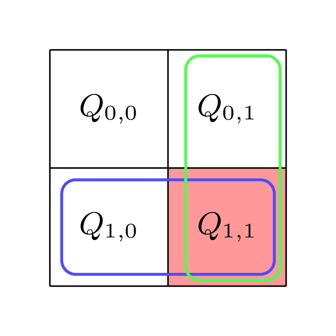
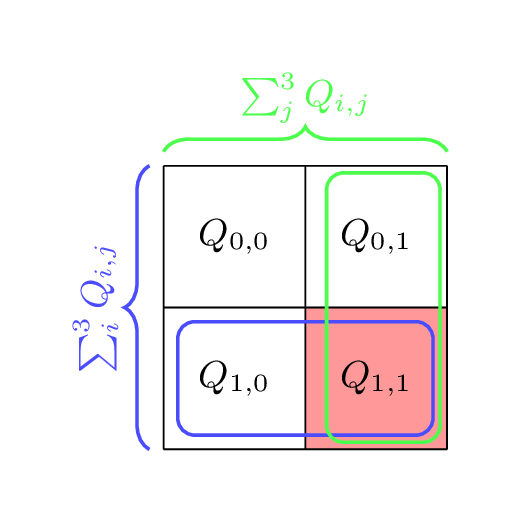
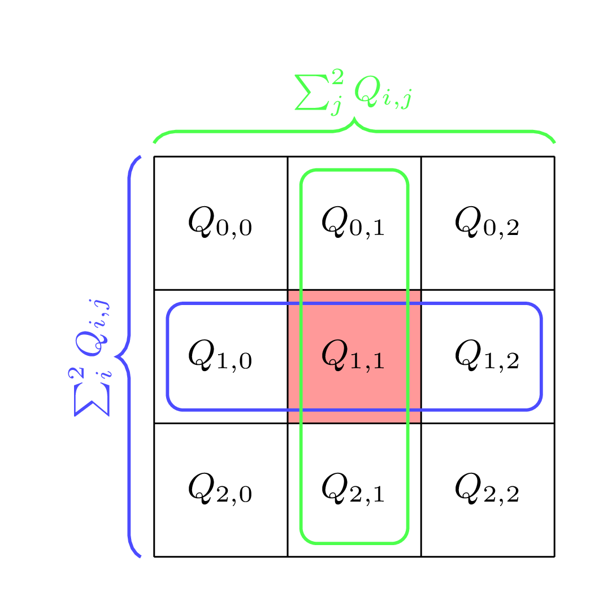
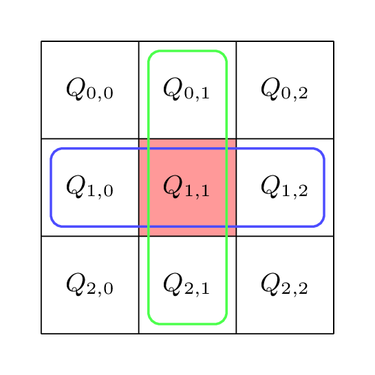

.. _Interpolation_C++API:

Interpolation
==============

The Interpolation class implements the :math:`\eta`-interpolation method.
This interpolation technique is based on charge sharing: for detected photon hits (e.g. clusters), it refines the estimated photon hit using information from neighboring pixels.

The method relies on the so-called :math:`\eta`-functions, which describe the relationship between the energy measured in the central cluster pixel (the initially estimated photon hit) and the energies measured in its neighboring pixels.
Depending on how much energy each neighboring pixel receives relative to the central pixel, the estimated photon hit is shifted toward that neighbor by a certain offset to the actual photon hit position in the pixel :math:`(x, y)`.

The mapping between the :math:`\eta` values and the corresponding spatial photon position :math:`(x,y)` can be viewed as an optimal transport problem.

One can readily compute the probability distribution :math:`P_{\eta}` of the :math:`\eta` values by forming a 2D histogram.
However, the probability distribution :math:`P_{x,y}` of the true photon positions is generally unknown unless the detector is illuminated uniformly (i.e. under flat-field conditions).
In a flat-field, the photon positions are uniformly distributed.

With this assumption, the problem reduces to determining a transport map :math:`T:(\eta_x,\eta_y) \rightarrow (x,y)`, that pushes forward the distribution of :math:`(\eta_x, \eta_y)` to the known uniform distribution of photon positions of a flatfield.

The map :math:`T` is given by: 

.. math:: 
    \begin{align*}
        T_1: & F_{x}^{-1} F_{\eta_x|\eta_y} \\
        T_2: & F_{y}^{-1} F_{\eta_y|\eta_x}, 
    \end{align*}

where :math:`F_{\eta_x|\eta_y}` and :math:`F_{\eta_y|\eta_x}` are the conditional cumulative distribution functions e.g. :math:`F_{\eta_x|\eta_y}(\eta_x', \eta_y') = P_{\eta_x, \eta_y}(\eta_x \leq \eta_x' | \eta_y = \eta_y')`. 
And :math:`F_{x}` and :math:`F_{y}` are the cumulative distribution functions of :math:`x` and :math:`y`. Note as :math:`x` and :math:`y` are uniformly distributed :math:`F_{x}` and :math:`F_{y}` are the identity functions. The map :math:`T` thus simplifies to 

.. math:: 
    \begin{align*}
        T_1: & F_{\eta_x|\eta_y} \\
        T_2: & F_{\eta_y|\eta_x}. 
    \end{align*}

Note that for the implementation :math:`P_{\eta}` is not only a distribution of :math:`\eta_x`, :math:`\eta_y` but also of the estimated photon energy :math:`e`. 
The energy level correlates slightly with the z-depth. Higher z-depth leads to more charge sharing and a different :math:`\eta` distribution. Thus we create a mapping :math:`T` for each energy level. 

:math:`\eta`-Functions: 
---------------------------

.. doxygenstruct:: aare::Eta2
    :members: 
    :undoc-members: 
    :private-members: 

.. note::
    The corner value ``c`` is only relevant when one uses ``calculate_eta_2`` or ``calculate_full_eta2``. Otherwise its default value is ``cTopLeft``. 

Supported are the following :math:`\eta`-functions: 

:math:`\eta`-Function on 2x2 Clusters: 
^^^^^^^^^^^^^^^^^^^^^^^^^^^^^^^^^^^^^^^

.. math:: 
    \begin{equation*}
   {\color{blue}{\eta_x}} = \frac{Q_{1,1}}{Q_{1,0} + Q_{1,1}} \quad \quad 
   {\color{green}{\eta_y}} = \frac{Q_{1,1}}{Q_{0,1} + Q_{1,1}}
   \end{equation*}

The :math:`\eta` values can range between 0,1. Note they only range between 0,1 because the position of the center pixel (red) can change. 
If the center pixel is in the bottom left pixel :math:`\eta_x` will be close to zero. If the center pixel is in the bottom right pixel :math:`\eta_y` will be close to 1.

One can apply this :math:`\eta` not only on 2x2 clusters but on clusters with any size. Then the 2x2 subcluster with maximum energy is choosen and the :math:`\eta` function applied on the subcluster.

.. doxygenfunction:: aare::calculate_eta2(const ClusterVector<ClusterType>&)

.. doxygenfunction:: aare::calculate_eta2(const Cluster<T, ClusterSizeX, ClusterSizeY, CoordType>&) 

Full :math:`\eta`-Function on 2x2 Clusters: 
^^^^^^^^^^^^^^^^^^^^^^^^^^^^^^^^^^^^^^^^^^^^

.. math:: 
    \begin{equation*}
        {\color{blue}{\eta_x}}  = \frac{Q_{0,1} + Q_{1,1}}{\sum_i^{1}\sum_j^{1}Q_{i,j}} \quad \quad
        {\textcolor{green}{\eta_y}} = \frac{Q_{1,0} + Q_{1,1}}{\sum_i^{1}\sum_j^{1}Q_{i,j}}
    \end{equation*} 

The :math:`\eta` values can range between 0,1. Note they only range between 0,1 because the position of the center pixel (red) can change. 
If the center pixel is in the bottom left pixel :math:`\eta_x` will be close to zero. If the center pixel is in the bottom right pixel :math:`\eta_y` will be close to 1. 

.. doxygenfunction:: aare::calculate_full_eta2(const ClusterVector<ClusterType>&)

.. doxygenfunction:: aare::calculate_full_eta2(const Cluster<T, ClusterSizeX, ClusterSizeY, CoordType>&)

Full :math:`\eta`-Function on 3x3 Clusters: 
^^^^^^^^^^^^^^^^^^^^^^^^^^^^^^^^^^^^^^^^^^^^

.. math::
    \begin{equation*}
         {\color{blue}{\eta_x}} = \frac{\sum_{i=0}^{2} Q_{i,2} - \sum_{i=0}^{2} Q_{i,0}}{\sum_{i=0}^{2}\sum_{j=0}^{2} Q_{i,j}} \quad \quad
        {\color{green}{\eta_y}} = \frac{\sum_{j=0}^{2} Q_{2,j} - \sum_{j=0}^{2} Q_{0,j}}{\sum_{i=0}^{2}\sum_{j=0}^{2} Q_{i,j}}
    \end{equation*}

The :math:`\eta` values can range between -0.5,0.5.

.. doxygenfunction:: aare::calculate_eta3(const ClusterVector<ClusterType>&)

.. doxygenfunction:: aare::calculate_eta3(const Cluster<T, ClusterSizeX, ClusterSizeY, CoordType>&)

Cross :math:`\eta`-Function on 3x3 Clusters: 
^^^^^^^^^^^^^^^^^^^^^^^^^^^^^^^^^^^^^^^^^^^^

.. math:: 
    \begin{equation*}
       {\color{blue}{\eta_x}} = \frac{Q_{1,2} - Q_{1,0}}{Q_{1,0} +  Q_{1,1} + Q_{1,2}} \quad \quad
        {\color{green}{\eta_y}} = \frac{Q_{0,2} - Q_{0,1}}{Q_{0,1} +  Q_{1,1} + Q_{2,1}}
    \end{equation*}

The :math:`\eta` values can range between -0.5,0.5. 

.. doxygenfunction:: aare::calculate_cross_eta3(const ClusterVector<ClusterType>&)

.. doxygenfunction:: aare::calculate_cross_eta3(const Cluster<T, ClusterSizeX, ClusterSizeY, CoordType>&)

Interpolation class: 
---------------------

.. warning:: 
   The interpolation might lead to erroneous photon positions for clusters at the borders of a frame. Make sure to filter out such cases. 

.. Warning:: 
    Make sure to use the same :math:`\eta`-function during interpolation as given by the joint :math:`\eta`-distribution passed to the constructor. 

.. Note:: 
    Make sure to use resonable energy bins, when constructing the joint distribution. If data is too sparse for a given energy the interpolation will lead to erreneous results.

.. doxygenclass:: aare::Interpolator
   :members:
   :undoc-members:
   :private-members:

