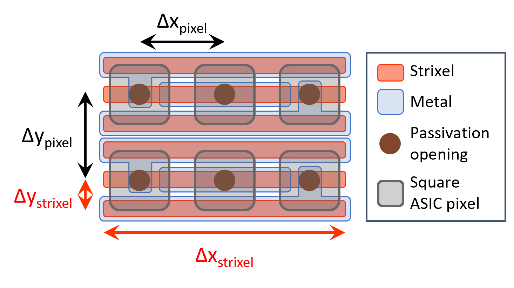
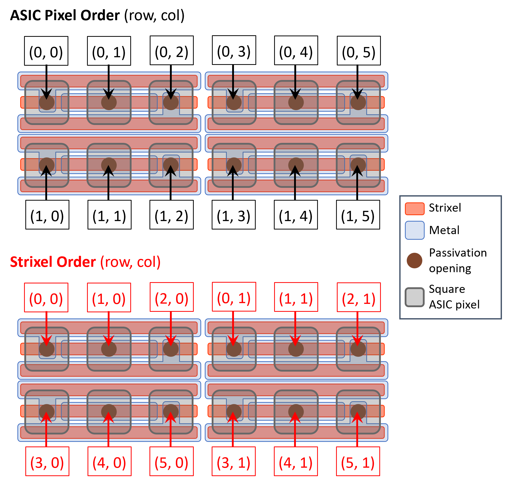

.. _py_strixel_remapping_index:

Strixel to Pixel Remapping 
============================

..
    maybe document what a strixel is in here how the remapping roughly works what types are predefined

Here the concepts behind the pixel reordering ("remapping") that needs to be applied for detectors using sensors
with "strixel" geometry and the corresponding API interface are explained.

The Strixel Concept
----------------------

A *strixel* is a rectangular sensor pixel.

The strixel's long edge is an integer multiple of the square pixel pitch
of the ASIC to which the sensor is coupled (i.e. 75 µm for the JUNGFRAU ASIC and 25 µm for MÖNCH). Its short edge,
in turn, is a fraction of the ASIC pixel pitch by the same integer.

.. IMPORTANT::
    The integer value that defines the strixel dimensioning with respect to the ASIC pixel is called the **strixel multiplicity** :math:`m`.

.. math::
    \begin{equation*}
        \Delta x_{\text{strixel}} = \Delta x_{\text{pixel}}\cdot m \quad \quad \Delta y_{\text{strixel}} = \frac{\Delta y_{\text{pixel}}}{m}
    \end{equation*}

    
    Example snippet of a strixel sensor layout with strixel multiplicity :math:`m = 3`.

.. admonition:: Physics Background

   Rectangular pixels provide a short pitch in one dimension that enables interpolation based on charge sharing
   while retaining compatibility with established readout ASICs such as JUNGFRAU and MÖNCH. Strixel sensors are
   especially important for detector applications such as **Resonant Inelastic X-ray Scattering (RIXS)** that require
   high spatial resolution in one dimension. 

.. admonition:: Fun Fact

   *"Strixel"* is a mashup between the words *"strip"* and *"pixel"*. The alternative version *"stripsel"* is also popular.

The Remapping Concept
-------------------------

Each strixel on a sensor is routed to a pixel on the readout ASIC. This reshuffles the order of the sensor strixels into the order
of the square ASIC pixels. In order to reproduce the real physical image on the sensor, we need to provide a map that uniquely
links each physical sensor strixel to its corresponding ASIC pixel. We refer to this procedure as "remapping".

    Illustrating the remapping between an ASIC pixel grid and a sensor strixel grid with :math:`m = 3`.

.. IMPORTANT::
    The remapping algorithm essentially reorders chunks of ASIC pixel columns into chunks of strixel rows based
    on the strixel multiplicity.

The resulting map describes

.. math::
    \begin{equation*}
        \text{strixel}(\text{row},\,\text{col}) \rightarrow \text{flattened ASIC pixel index} = y_{\text{pixel}}\cdot n_x + x_{\text{pixel}}
    \end{equation*}

where :math:`x_{\text{pixel}}` and :math:`y_{\text{pixel}}` are the x- and y-coordinates (column and row) of the reference ASIC pixel,
respectively, and :math:`n_x` is the total number of ASIC pixel columns of the reference pixel grid.

.. Note::
    The reference pixel grid does not necessarily have to correspond to exactly one ASIC. It could, for example, be the
    standard output of a single JUNGFRAU detector module with dimensions :math:`2\times 4` ASICs (:math:`512\times 1024` pixels)
    or any other user-chosen ROI. 

.. IMPORTANT::
    To generate a correct strixel-to-pixel map, the relative location of the contiguous strixel region on the sensor with respect
    to the reference pixel grid has to be known.

Example Usage
-------------

.. code:: python

   from aare import strixelremap 
   import numpy as np

   from aare import RawFile 

   file = RawFile("path/to/master_file.json") # Load a raw file with strixel data

   _, frame = file.read_frame() # Read the first frame of the file

   rx_roi = frame.master().rois[0] # Get ROI of the frame

   # Get the pixel to strixel map for the 25 µm pitch strixels placed on Chip1
   pixel_to_strixel_map_25um = strixelremap.Jungfrau_iLGAD_StrixelPixelMap(placement = strixelremap.Chip1)

   # calculate the map for the given ROI
   pixel_to_strixel_map_25um.calculate_map(rx_roi) 

   # apply map 
   mapped_strixels = pixel_to_strixel_map_25um(frame)

Alternatively, one can directly pass the map to the :code:`RawFile` reader to automatically remap the strixels when reading the frame:

.. code:: python

   from aare import strixelremap 
   import numpy as np

   from aare import RawFile 

   # Get the pixel to strixel map for the 25 µm pitch strixels placed on Chip1
   pixel_to_strixel_map_25um = strixelremap.Jungfrau_iLGAD_StrixelPixelMap(placement = strixelremap.Chip1)

   file = RawFile("path/to/master_file.json") # Load a raw file with strixel data

   with RawFile("path/to/master_file.json", strixeltransform = [pixel_to_strixel_map_25um]) as f:
        header, frames = f.read_frame()

API Documentation
------------------

.. toctree::
   :caption: Pixel to Strixel Remapping
   :maxdepth: 1

   pySensorConfiguration
   pyStrixelPixelRemapAlgorithm
   pyInclusiveROI
   pyPredefinedMaps
   pyPredefinedSensorConfigs

  